# 🧩 Sudoku Solver

<!--  (Add your own banner or a screenshot here!) -->

## ✨ Description

This project is an **Automatic Sudoku Solver** that uses advanced image processing to recognize and solve Sudoku puzzles from scanned or photographed images (**JPG, PNG, or BMP**).

-   **Detects** the Sudoku grid in the input image  
-   **Extracts** individual cells, applies custom thresholding, and uses template matching to recognize each digit  
-   **Solves** the Sudoku using a backtracking algorithm  
-   **Displays** the complete solution in a clean, readable digital format

---

|      ⬇️ **Input**      |     ⬆️ **Output**     |
|:----------------------:|:--------------------:|
| 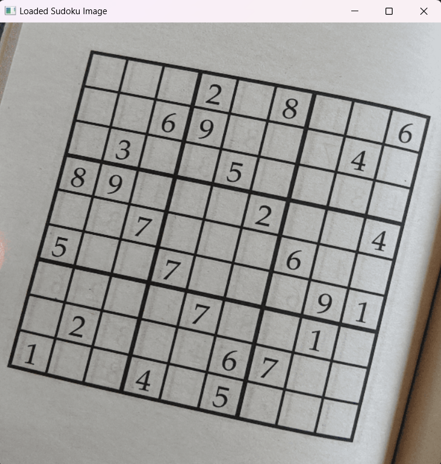 <br> *A scanned or photographed image (JPG, PNG, BMP) containing a clear Sudoku grid.* | 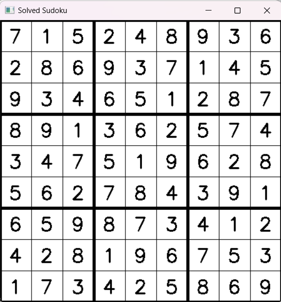 <br> *A digital display of the recognized and solved Sudoku puzzle.* |


 
🌱 *Fast, fully automatic, and robust to real-world image imperfections!*

---
## 🎯 Input Constraints

> [!Tip]
>  For best results, make sure your input images follow these guidelines:

-   **Brightness:**  
  The image must **not be too dark** – digits and grid lines should be clearly visible.

-   **Orientation:**  
  The Sudoku grid should **not be upside down or rotated**; keep it upright and aligned.

-   **Completeness:**  
  The grid should be **complete** and contain only **one Sudoku puzzle** per image.

-   **Digit Clarity:**  
  Digits should be **clear** and printed in a **standard font** (avoid handwriting or unusual styles).


---

## 🚀 High-Level Architecture

This project processes Sudoku images through the following main steps:

1.   **Input Image:** User selects a scanned or photographed Sudoku puzzle.
2.   **Preprocessing:** Convert to grayscale, blur, and threshold to enhance grid and digits.
3.   **Grid Detection:** Detect the Sudoku grid with edge detection and perspective correction.
4.   **Cell Segmentation:** Split the grid into 81 individual cell images.
5.   **Digit Recognition:** Clean, center, and compare each cell with digit templates.
6.   **Sudoku Solver:** Solve the grid using a backtracking algorithm.
7.   **Result Display:** Display the recognized and solved Sudoku digitally.

---
## 🪁 Implementation Steps

>### Step 1. Grid Detection & Localization
 

#### 🔽 Loading the Sudoku Image  
User selects a scanned or photographed Sudoku puzzle using a file dialog. The image is loaded and resized if needed for processing.

 
 

#### 🌚 Convert to Grayscale  
The input color image is converted to grayscale to simplify further processing.

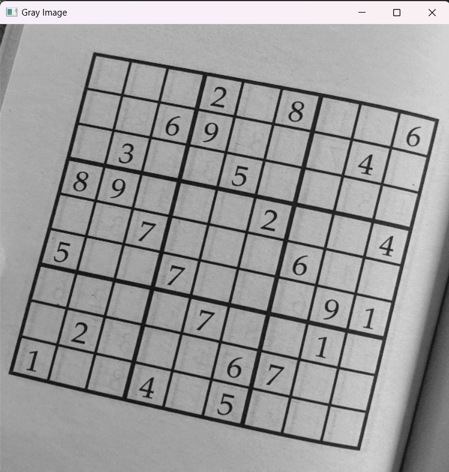

 

#### 🟦 Canny Edge Detection  
Detect strong edges, making grid lines stand out.

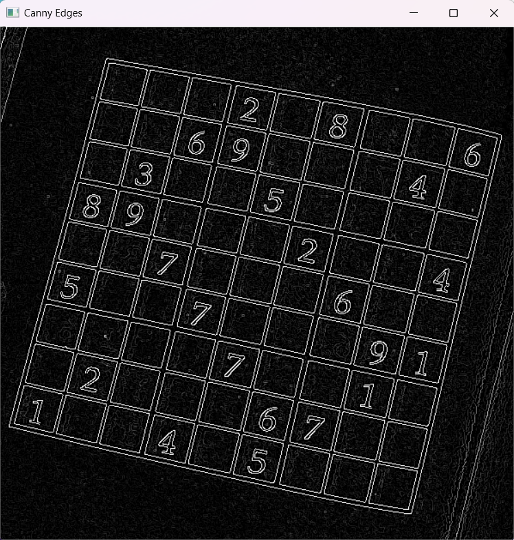

 

#### 🔗 Edge Linking  
Connect edge fragments for cleaner, continuous contours.

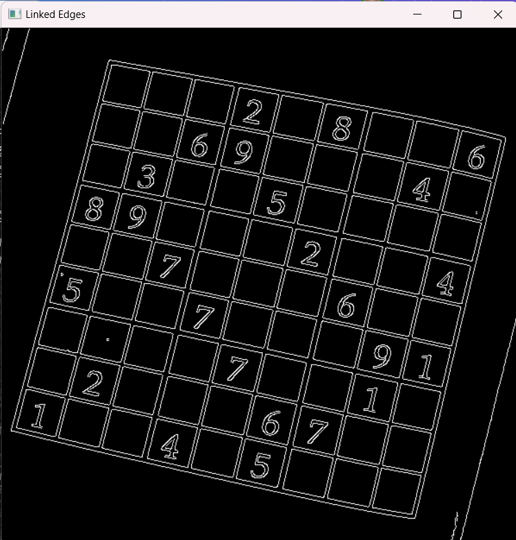

 
#### ➕ Dilation  
Expand and strengthen grid lines by dilating the edges.

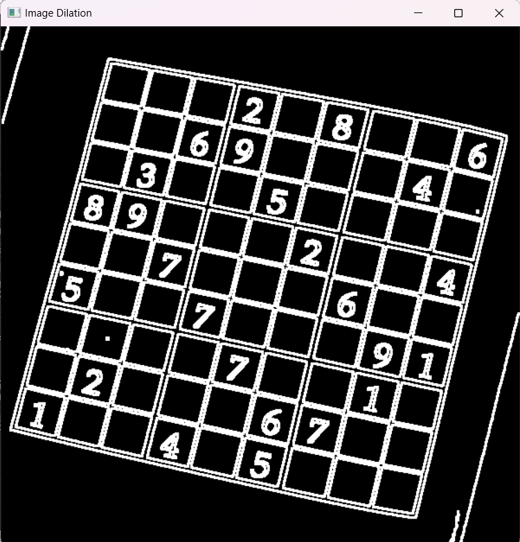

 

#### 🎨 Find All Contours  
Detect all possible closed shapes (contours) in the image.

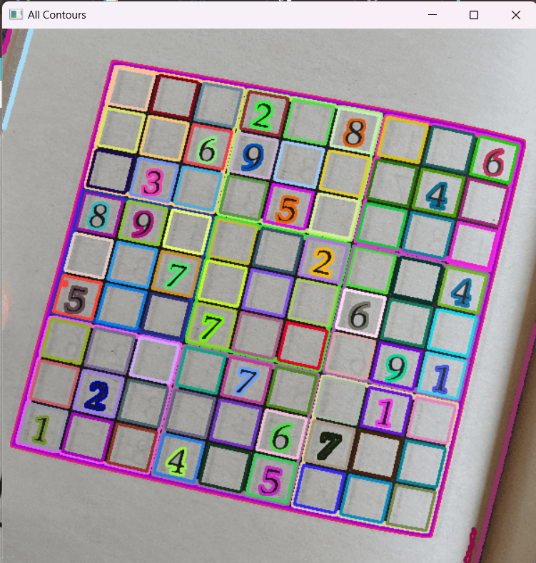
 

#### 🔲 Select Biggest Contour  
Find the largest 4-point contour, presumed to be the Sudoku grid.

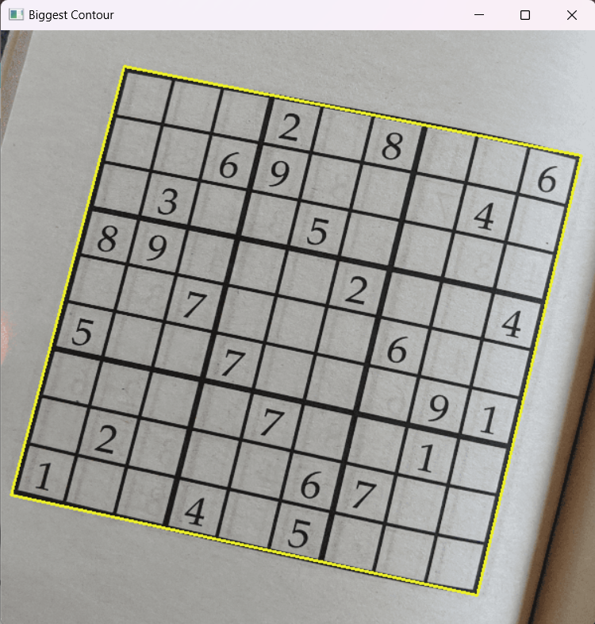

 
#### ✂️ Warp Sudoku  
Straighten and crop the grid to a perfect square using a perspective transform.

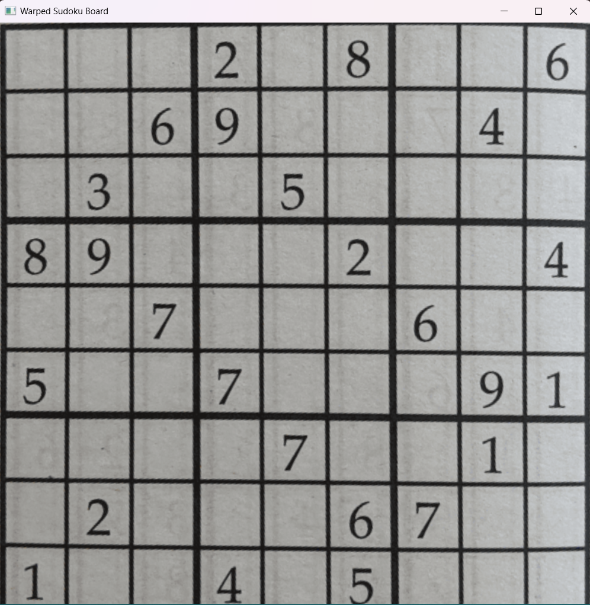


>### 🔢 Step 2. Divide Cells

 
#### 1️⃣ Cell Segmentation  
After localizing and warping the Sudoku grid, the image is divided into **81 equal-sized cells** for digit recognition.

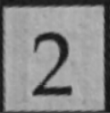
 

#### ⚫️ Cell Thresholding  
Convert each cell image to a clean **black-and-white (binary)** format, making digits stand out from the background.

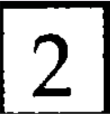

 

#### 🧹 Border Removing  
Remove black grid lines or artifacts around the edges of each cell, ensuring only the digit remains for recognition.

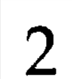

 
#### 🎯 Digit Centering  
Center the digit within the cell image to improve template matching accuracy.  
Templates used for comparison contain black digits that fill **80% of the image width**, ensuring consistent alignment and scale.

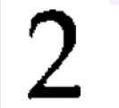

>### 🔍 Step 3. Digit Recognition

#### 🏷️ Template Matching

Identify which digit is present in each cell by comparing the processed cell image with a set of labeled reference images (**templates**) for each digit (1–9).

- For each cell, the algorithm compares its pixels to each digit template (same size, possibly different fonts).
- It counts how many black pixels overlap.
- The digit whose template has the highest overlap score (using the **Dice/F1 coefficient** for fairness) is selected as the recognized digit.

Templates used for comparison contain black digits that fill 80% of the image width. Recentering the image ensuring consistent alignment and scale.

**Algorithm Pseudocode:**
```c++
pixelMatchScore(cell_image, template_image):
    match_count = 0
    cell_black = 0
    template_black = 0
    for each pixel (y, x) in cell_image:
        if cell_image[y, x] is black and template_image[y, x] is black:
            match_count += 1
        if cell_image[y, x] is black:
            cell_black += 1
        if template_image[y, x] is black:
            template_black += 1
    score = 2 * match_count / (cell_black + template_black)
    return score
```

> ### 🧮 Step 4. Solving the Sudoku

The recognized grid is solved using a classic **backtracking algorithm**, which fills in the empty cells one by one and backtracks when a conflict is found, ensuring a valid and complete solution for the puzzle.

---
## 🏁 Results

The project was tested on multiple scanned and photographed Sudoku puzzles with different print qualities and fonts.

- For each input image, the program successfully localized the grid, recognized the digits, and displayed both the recognized and solved grids.
- Sample cases demonstrate **accurate digit extraction** and **robust solving**, even with minor noise or grid imperfections.

---

| 🖼️ Unsolved Grid                | 🧩 Solved Sudoku                      |
|---------------------------------------|---------------------------------------|
| 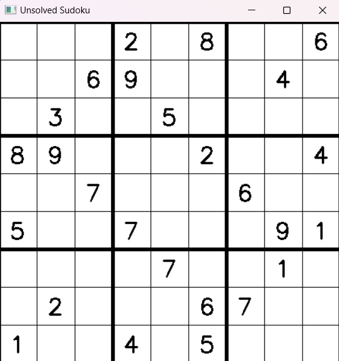 |  |

 

🌟 *These examples show the system’s ability to digitize and solve real-world Sudoku puzzles automatically!*

---
## 📖 User Manual

### 🕹️ Requirements

-  C++ compiler (Visual Studio or g++)
-  [OpenCV library](https://opencv.org/) (version 3.x or newer)
-   Image files: Sudoku scans/photos in **JPG, PNG, or BMP** format
-   Digit templates (`nr_1.png`, `nr_2.png`, ...) in a `/Digits/` folder

---

### 📦 Instructions

1. **Prepare Templates:**  
   Place digit template images (`nr_1.png`, `nr_2.png`, ...) in a folder named `Digits` in your project directory.

2. **Prepare Input Images:**  
   Place your scanned or photographed Sudoku images in an `Images` folder.

3. **Start the Program:**  
   Run the executable or start from your IDE.

4. **Load a Sudoku Image:**  
   When prompted, select an image file from the `Images` folder using the file dialog.

5. **View Results:**  
   - The recognized grid and the solved Sudoku will be displayed in separate windows.
   - The recognized digits are shown in the console and as an image.

6. **Exit:**  
   Choose the exit option in the program menu or simply close the window.
 

> [!Tip]
>- For best results, use **clear, well-lit images** with the grid upright and digits readable.
>- Make sure the **template digit images match the font style** of your Sudoku puzzles.

---
⭐ If you enjoyed this project, please give it a star! 🌟